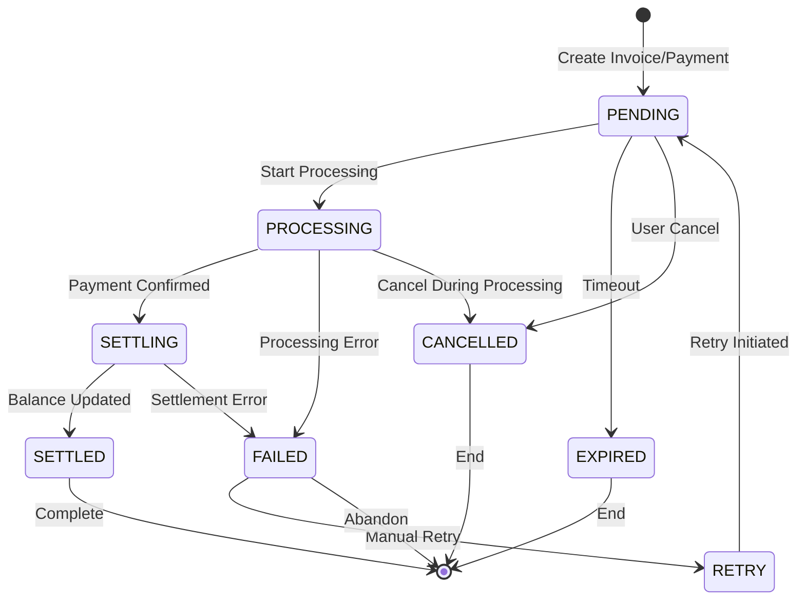

# MGINX - Multi-Wallet NWC Management System
## Product Design Document

### Executive Summary
MGINX is a sophisticated wallet management system that enables a single upstream NWC (Nostr Wallet Connect) connection to be multiplexed into multiple virtual sub-wallets, each with independent balances, transaction histories, and NWC connection strings. The system maintains strict balance tracking through SQLite persistence and implements a comprehensive state machine for transaction lifecycle management.

### Core Features
1. **Virtual Sub-Wallet Creation**: Generate unlimited sub-wallets from a single upstream NWC connection
2. **Independent Balance Management**: Each sub-wallet maintains its own balance tracked in SQLite
3. **Transaction State Machine**: Robust state tracking for all payment operations
4. **Real-time Balance Updates**: Webhook-based notification system for instant balance updates
5. **Audit Trail**: Complete transaction history with state transitions logged in database

## System Architecture

### Components Overview

```
┌─────────────────────────────────────────────────────────┐
│                     User Interface                       │
│  ┌──────────┐  ┌──────────┐  ┌─────────────────────┐   │
│  │ Dashboard│  │Sub-Wallet│  │Transaction History  │   │
│  │          │  │Management│  │      Viewer         │   │
│  └──────────┘  └──────────┘  └─────────────────────┘   │
└─────────────────────────────────────────────────────────┘
                            │
┌─────────────────────────────────────────────────────────┐
│                    MGINX Core Service                    │
│  ┌──────────────┐  ┌─────────────┐  ┌──────────────┐   │
│  │Wallet Manager│  │State Machine│  │Balance Engine│   │
│  └──────────────┘  └─────────────┘  └──────────────┘   │
└─────────────────────────────────────────────────────────┘
                            │
┌─────────────────────────────────────────────────────────┐
│                    Data Layer                            │
│  ┌──────────────┐  ┌─────────────┐  ┌──────────────┐   │
│  │   SQLite DB  │  │Redis Cache  │  │Event Store   │   │
│  └──────────────┘  └─────────────┘  └──────────────┘   │
└─────────────────────────────────────────────────────────┘
                            │
┌─────────────────────────────────────────────────────────┐
│                 External Connections                     │
│  ┌──────────────┐  ┌─────────────┐  ┌──────────────┐   │
│  │Upstream NWC  │  │Nostr Relays │  │Client Wallets│   │
│  └──────────────┘  └─────────────┘  └──────────────┘   │
└─────────────────────────────────────────────────────────┘
```

## Database Schema

### SQLite Tables

```sql
-- Main wallets table
CREATE TABLE wallets (
    id TEXT PRIMARY KEY,
    pubkey TEXT UNIQUE NOT NULL,
    name TEXT,
    description TEXT,
    balance INTEGER NOT NULL DEFAULT 0,
    pending_balance INTEGER NOT NULL DEFAULT 0,
    created_at TIMESTAMP DEFAULT CURRENT_TIMESTAMP,
    updated_at TIMESTAMP DEFAULT CURRENT_TIMESTAMP,
    status TEXT CHECK(status IN ('active', 'suspended', 'deleted')) DEFAULT 'active',
    metadata JSON
);

-- Transactions table with state machine
CREATE TABLE transactions (
    id TEXT PRIMARY KEY,
    wallet_id TEXT NOT NULL,
    type TEXT CHECK(type IN ('invoice', 'payment', 'internal_transfer')),
    direction TEXT CHECK(direction IN ('incoming', 'outgoing')),
    amount INTEGER NOT NULL,
    state TEXT NOT NULL,
    invoice TEXT,
    payment_hash TEXT,
    description TEXT,
    description_hash TEXT,
    preimage TEXT,
    expires_at TIMESTAMP,
    settled_at TIMESTAMP,
    created_at TIMESTAMP DEFAULT CURRENT_TIMESTAMP,
    updated_at TIMESTAMP DEFAULT CURRENT_TIMESTAMP,
    metadata JSON,
    FOREIGN KEY (wallet_id) REFERENCES wallets(id)
);

-- State transitions audit log
CREATE TABLE state_transitions (
    id INTEGER PRIMARY KEY AUTOINCREMENT,
    transaction_id TEXT NOT NULL,
    from_state TEXT,
    to_state TEXT NOT NULL,
    reason TEXT,
    metadata JSON,
    created_at TIMESTAMP DEFAULT CURRENT_TIMESTAMP,
    FOREIGN KEY (transaction_id) REFERENCES transactions(id)
);

-- Balance history for audit trail
CREATE TABLE balance_history (
    id INTEGER PRIMARY KEY AUTOINCREMENT,
    wallet_id TEXT NOT NULL,
    transaction_id TEXT,
    previous_balance INTEGER NOT NULL,
    new_balance INTEGER NOT NULL,
    change_amount INTEGER NOT NULL,
    operation TEXT,
    created_at TIMESTAMP DEFAULT CURRENT_TIMESTAMP,
    FOREIGN KEY (wallet_id) REFERENCES wallets(id),
    FOREIGN KEY (transaction_id) REFERENCES transactions(id)
);

-- NWC connection strings
CREATE TABLE wallet_connections (
    id INTEGER PRIMARY KEY AUTOINCREMENT,
    wallet_id TEXT NOT NULL,
    connection_uri TEXT NOT NULL,
    relay_urls JSON NOT NULL,
    created_at TIMESTAMP DEFAULT CURRENT_TIMESTAMP,
    last_seen TIMESTAMP,
    FOREIGN KEY (wallet_id) REFERENCES wallets(id)
);

-- Indexes for performance
CREATE INDEX idx_transactions_wallet_id ON transactions(wallet_id);
CREATE INDEX idx_transactions_payment_hash ON transactions(payment_hash);
CREATE INDEX idx_transactions_state ON transactions(state);
CREATE INDEX idx_balance_history_wallet_id ON balance_history(wallet_id);
CREATE INDEX idx_state_transitions_transaction_id ON state_transitions(transaction_id);
```

## State Machine Design

### Transaction States



### State Definitions

| State | Description | Valid Transitions |
|-------|-------------|------------------|
| **PENDING** | Initial state for new transaction | PROCESSING, EXPIRED, CANCELLED |
| **PROCESSING** | Transaction being processed by upstream | SETTLING, FAILED, CANCELLED |
| **SETTLING** | Payment confirmed, updating balances | SETTLED, FAILED |
| **SETTLED** | Transaction complete, balances updated | Terminal state |
| **FAILED** | Transaction failed with error | RETRY or Terminal |
| **EXPIRED** | Invoice/payment expired | Terminal state |
| **CANCELLED** | User or system cancelled | Terminal state |
| **RETRY** | Failed transaction being retried | PENDING |

### State Transition Rules

```typescript
interface StateTransitionRules {
  PENDING: {
    validTransitions: ['PROCESSING', 'EXPIRED', 'CANCELLED'];
    conditions: {
      PROCESSING: () => upstreamAccepted && !isExpired;
      EXPIRED: () => currentTime > expiresAt;
      CANCELLED: () => userInitiatedCancel || systemCancel;
    };
  };
  
  PROCESSING: {
    validTransitions: ['SETTLING', 'FAILED', 'CANCELLED'];
    conditions: {
      SETTLING: () => paymentConfirmed && validPreimage;
      FAILED: () => upstreamError || networkError;
      CANCELLED: () => canCancelInFlight && userRequest;
    };
  };
  
  SETTLING: {
    validTransitions: ['SETTLED', 'FAILED'];
    conditions: {
      SETTLED: () => balanceUpdated && dbCommitted;
      FAILED: () => dbError || consistencyError;
    };
  };
}
```

## Balance Management

### Balance Update Flow

```typescript
class BalanceEngine {
  async updateBalance(
    walletId: string, 
    amount: number, 
    transactionId: string,
    operation: 'credit' | 'debit' | 'reserve' | 'release'
  ): Promise<BalanceUpdate> {
    return await this.db.transaction(async (tx) => {
      // 1. Lock wallet row
      const wallet = await tx.query(
        'SELECT * FROM wallets WHERE id = ? FOR UPDATE',
        [walletId]
      );
      
      // 2. Calculate new balances
      let newBalance = wallet.balance;
      let newPending = wallet.pending_balance;
      
      switch(operation) {
        case 'reserve':
          // Reserve funds for outgoing payment
          if (wallet.balance < amount) {
            throw new InsufficientBalanceError();
          }
          newBalance -= amount;
          newPending += amount;
          break;
          
        case 'release':
          // Release reserved funds (payment failed)
          newBalance += amount;
          newPending -= amount;
          break;
          
        case 'debit':
          // Confirm outgoing payment
          newPending -= amount;
          break;
          
        case 'credit':
          // Incoming payment
          newBalance += amount;
          break;
      }
      
      // 3. Update wallet
      await tx.query(
        'UPDATE wallets SET balance = ?, pending_balance = ?, updated_at = ? WHERE id = ?',
        [newBalance, newPending, new Date(), walletId]
      );
      
      // 4. Record history
      await tx.query(
        'INSERT INTO balance_history (wallet_id, transaction_id, previous_balance, new_balance, change_amount, operation) VALUES (?, ?, ?, ?, ?, ?)',
        [walletId, transactionId, wallet.balance, newBalance, amount, operation]
      );
      
      return { newBalance, newPending, previousBalance: wallet.balance };
    });
  }
}
```

### Balance Consistency Rules

1. **Atomic Updates**: All balance changes must be wrapped in database transactions
2. **Double-Entry**: Every debit must have corresponding credit (except external transactions)
3. **Pending Balance**: Reserved funds tracked separately to prevent double-spending
4. **Audit Trail**: Every balance change recorded with transaction reference
5. **Reconciliation**: Periodic reconciliation with upstream wallet balance

## API Design

### REST Endpoints

```yaml
# Wallet Management
GET    /api/wallets                 # List all sub-wallets
POST   /api/wallets                 # Create new sub-wallet
GET    /api/wallets/{id}           # Get wallet details
PUT    /api/wallets/{id}           # Update wallet metadata
DELETE /api/wallets/{id}           # Soft delete wallet

# Balance Operations  
GET    /api/wallets/{id}/balance   # Get current balance
GET    /api/wallets/{id}/history   # Get balance history

# Transactions
GET    /api/wallets/{id}/transactions      # List transactions
POST   /api/wallets/{id}/invoice          # Create invoice
POST   /api/wallets/{id}/pay              # Pay invoice
GET    /api/transactions/{id}             # Get transaction details
GET    /api/transactions/{id}/state       # Get state history

# NWC Management
GET    /api/wallets/{id}/nwc              # Get NWC connection URI
POST   /api/wallets/{id}/nwc/regenerate   # Generate new NWC credentials

# Admin Operations
GET    /api/admin/reconcile               # Trigger reconciliation
GET    /api/admin/health                  # System health check
POST   /api/admin/wallets/{id}/suspend    # Suspend wallet
POST   /api/admin/wallets/{id}/activate   # Reactivate wallet
```

### WebSocket Events

```typescript
interface WebSocketEvents {
  // Balance updates
  'balance:updated': {
    walletId: string;
    previousBalance: number;
    newBalance: number;
    transactionId?: string;
  };
  
  // Transaction state changes
  'transaction:state': {
    transactionId: string;
    previousState: string;
    newState: string;
    metadata?: any;
  };
  
  // Payment notifications
  'payment:received': {
    walletId: string;
    amount: number;
    invoice: string;
    paymentHash: string;
  };
  
  'payment:sent': {
    walletId: string;
    amount: number;
    invoice: string;
    preimage: string;
  };
  
  // System events
  'wallet:created': {
    walletId: string;
    pubkey: string;
  };
  
  'wallet:suspended': {
    walletId: string;
    reason: string;
  };
}
```

## User Interface Design

### Main Dashboard
```
┌──────────────────────────────────────────────────┐
│ MGINX Wallet Manager                     [Settings]│
├──────────────────────────────────────────────────┤
│ Total Balance: 1,500,000 sats                    │
│ Sub-Wallets: 5 active | 2 suspended              │
│                                                   │
│ [+ Create New Wallet]                            │
├──────────────────────────────────────────────────┤
│ Sub-Wallets                                      │
│ ┌────────────────────────────────────────────┐  │
│ │ 🟢 Personal Wallet          500,000 sats   │  │
│ │    Last activity: 2 hours ago              │  │
│ │    [View] [Manage] [NWC]                   │  │
│ └────────────────────────────────────────────┘  │
│ ┌────────────────────────────────────────────┐  │
│ │ 🟢 Business Wallet          800,000 sats   │  │
│ │    Last activity: 10 minutes ago           │  │
│ │    [View] [Manage] [NWC]                   │  │
│ └────────────────────────────────────────────┘  │
│ ┌────────────────────────────────────────────┐  │
│ │ 🔴 Test Wallet (Suspended)   50,000 sats   │  │
│ │    Suspended: Insufficient activity        │  │
│ │    [Reactivate] [Delete]                   │  │
│ └────────────────────────────────────────────┘  │
└──────────────────────────────────────────────────┘
```

### Create Sub-Wallet Modal
```
┌──────────────────────────────────────────────────┐
│ Create New Sub-Wallet                        [X] │
├──────────────────────────────────────────────────┤
│                                                   │
│ Wallet Name:                                     │
│ ┌────────────────────────────────────────────┐  │
│ │ My New Wallet                               │  │
│ └────────────────────────────────────────────┘  │
│                                                   │
│ Description (optional):                          │
│ ┌────────────────────────────────────────────┐  │
│ │ For online purchases                        │  │
│ └────────────────────────────────────────────┘  │
│                                                   │
│ Initial Balance (sats):                          │
│ ┌────────────────────────────────────────────┐  │
│ │ 100000                                      │  │
│ └────────────────────────────────────────────┘  │
│                                                   │
│ □ Generate NWC connection immediately            │
│                                                   │
│ [Cancel]                        [Create Wallet]  │
└──────────────────────────────────────────────────┘
```

### Wallet Detail View
```
┌──────────────────────────────────────────────────┐
│ Personal Wallet                           [Back] │
├──────────────────────────────────────────────────┤
│ Balance: 500,000 sats                            │
│ Pending: 10,000 sats                             │
│ Status: Active                                   │
│                                                   │
│ [Send Payment] [Request Payment] [Export NWC]    │
├──────────────────────────────────────────────────┤
│ Recent Transactions                    [View All]│
│ ┌────────────────────────────────────────────┐  │
│ │ ↓ Received      +50,000 sats    2h ago    │  │
│ │   From: Coffee Shop                        │  │
│ │   State: SETTLED                            │  │
│ └────────────────────────────────────────────┘  │
│ ┌────────────────────────────────────────────┐  │
│ │ ↑ Sent          -10,000 sats    5h ago    │  │
│ │   To: Online Store                         │  │
│ │   State: SETTLED                            │  │
│ └────────────────────────────────────────────┘  │
│ ┌────────────────────────────────────────────┐  │
│ │ ⏳ Pending       +25,000 sats    10m ago   │  │
│ │   Invoice expires in 50 minutes            │  │
│ │   State: PENDING                            │  │
│ └────────────────────────────────────────────┘  │
└──────────────────────────────────────────────────┘
```

## Security Considerations

### Access Control
- **Authentication**: JWT-based authentication for API access
- **Authorization**: Role-based access control (admin, user, viewer)
- **Wallet Isolation**: Each sub-wallet has isolated access credentials
- **Rate Limiting**: Per-wallet rate limits to prevent abuse

### Data Protection
- **Encryption**: All sensitive data encrypted at rest (AES-256)
- **Key Management**: Separate key derivation for each sub-wallet
- **Audit Logging**: All operations logged with user/system attribution
- **Backup Strategy**: Automated encrypted backups of SQLite database

### Transaction Security
- **Idempotency**: All payment operations idempotent via payment_hash
- **Double-Spend Prevention**: Pessimistic locking on balance updates
- **Timeout Management**: Automatic expiry of pending transactions
- **Reconciliation**: Daily reconciliation with upstream wallet

## Implementation Phases

### Phase 1: Core Infrastructure (Week 1-2)
- SQLite database setup and migrations
- Basic wallet CRUD operations
- State machine implementation
- Balance tracking engine

### Phase 2: NWC Integration (Week 3-4)
- Upstream wallet connection
- Nostr relay communication
- NWC protocol implementation
- Payment forwarding logic

### Phase 3: User Interface (Week 5-6)
- Dashboard implementation
- Wallet management screens
- Transaction views
- Real-time updates via WebSocket

### Phase 4: Advanced Features (Week 7-8)
- Bulk operations
- Export/import functionality
- Advanced reporting
- Webhook integrations

### Phase 5: Production Hardening (Week 9-10)
- Performance optimization
- Security audit
- Load testing
- Documentation and deployment

## Monitoring & Metrics

### Key Performance Indicators
- **Transaction Success Rate**: Target >99.5%
- **Balance Accuracy**: 100% reconciliation accuracy
- **API Response Time**: <100ms for read, <500ms for write
- **State Transition Time**: <2s for payment settlement
- **System Uptime**: 99.9% availability target

### Monitoring Dashboard
```
┌──────────────────────────────────────────────────┐
│ System Health Dashboard                          │
├──────────────────────────────────────────────────┤
│ Transactions/Hour: 1,234  Success Rate: 99.8%   │
│ Active Wallets: 45        Total Balance: 50M    │
│ Pending Transactions: 12  Failed (24h): 3       │
│                                                   │
│ [State Distribution Graph]                       │
│ SETTLED: ████████████████ 85%                   │
│ PENDING: ██ 10%                                  │
│ FAILED:  █ 5%                                    │
│                                                   │
│ [Response Time Graph - Last 24h]                 │
│ API: ~95ms  DB: ~12ms  Upstream: ~250ms         │
└──────────────────────────────────────────────────┘
```

## Error Handling Strategy

### Error Categories
1. **Transient Errors**: Automatic retry with exponential backoff
2. **Balance Errors**: Immediate suspension and admin alert
3. **Network Errors**: Circuit breaker pattern with fallback
4. **Data Errors**: Transaction rollback and state recovery
5. **System Errors**: Graceful degradation and health checks

### Recovery Procedures
- **Automatic Recovery**: Self-healing for transient failures
- **Manual Intervention**: Admin tools for complex issues
- **Data Recovery**: Point-in-time restore from backups
- **State Recovery**: Rebuild state from event log

## Conclusion

MGINX provides a robust, scalable solution for managing multiple virtual wallets through a single NWC connection. The combination of strict state machine controls, comprehensive balance tracking, and SQLite persistence ensures reliable operation while maintaining the flexibility needed for various use cases. The system's modular architecture allows for easy extension and integration with existing wallet infrastructure.